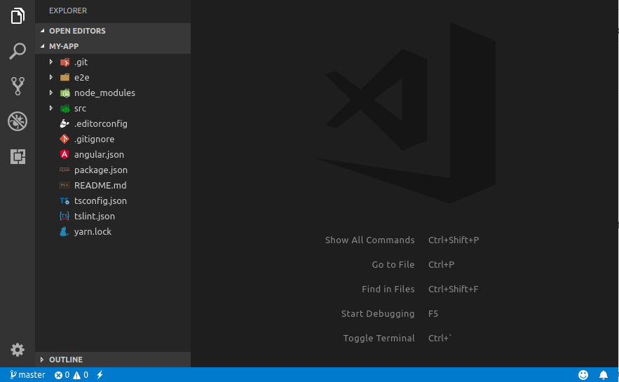

# new

### Overview

`ng new <name> [options]` creates a new angular application.

Default applications are created in a directory of the same name, with an initialized Angular application.

### Options

`--name` \(type `string`\)  
OPTIONAL: The name of the workspace. You can write the application name direct after `ng new`.

`--collection` \(alias `-c`\)   
Schematics collection to use.

`--directory` \(type `string`\)  
The directory name to create the workspace in.

`--dry-run` \(alias `-d`\)   
Run through without making any changes.

`--experimental-ivy` \(default `false`\)  
EXPERIMENTAL: Specifies whether to create a new application which uses the Ivy rendering engine.

`--force` \(alias `-f`\)   
Forces overwriting of files.

`--inline-style` \(alias `-s`, default `false`\)  
Specifies if the style will be in the ts file.

`--inline-template` \(alias `-t`, default `false`\)  
Specifies if the template will be in the ts file.

`--new-project-root` \(default `projects`\)  
The path where new projects will be created.

`--prefix` \(alias `-p`, default `app`\)  
The prefix to apply to generated selectors.

`--routing` \(default `false`\)  
Generates a routing module.

`--skip-git` \(alias `-g`, default `false`\)  
Skip initializing a git repository.

`--skip-install` \(default `false`\)  
Skip installing dependency packages.

`--skip-tests`  \(alias `-S`\)  
Skip creating spec files.

`--style` \(default `css`\)  
The file extension to be used for style files.  
Available values:  
- `css` - CSS  
- `scss` - [_SCSS_](http://sass-lang.com)  
- `sass` - [_SASS_](http://sass-lang.com)  
- `less` - [_LESS_](http://lesscss.org)  
_-_ `styl` - [_Stylus_](http://stylus-lang.com)\_\_

`--verbose` \(alias `-v`\)  
Adds more details to output logging.

`--view-encapsulation` \(type `string`\)  
Specifies the view encapsulation strategy.  
Available values:  
- `None` - No Shadow DOM at all. Therefore, also no style encapsulation.  
- `Emulated` - No Shadow DOM but style encapsulation emulation.  
- `Native` - Native Shadow DOM with all it’s goodness.  


`--help` \(alias `-h`\)  
Help.

### Example

The first thing you’ll need to do is generate a new app.

```bash
ng new my-app --prefix app --style scss --skip-tests --verbose
```

This command will create your app and install the dependencies.



The CLI configuration options can be found in the `angular.json` file in the root of the project. It is possible to have multiple apps and libraries in a single CLI workspace. If necessary, you can edit values in this file to change the behavior of the CLI, but that’s usually only required for more advanced use cases.


Schema structure for `angular.json` file can be find in GitHub angular-cli repository in [`schema.json`](https://github.com/angular/angular-cli/blob/master/packages/angular/cli/lib/config/schema.json) file.


Go to [_next command_](ng-serve.md) to make sure the app works in the browser.

