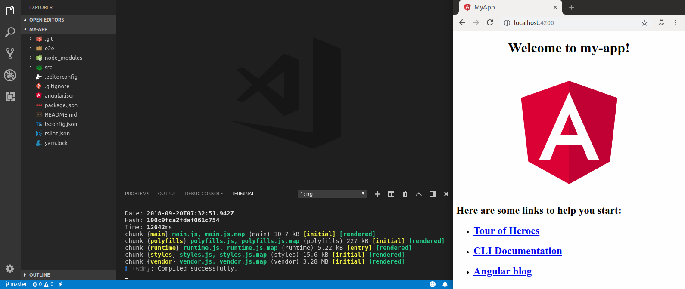

# serve

### Overview

`ng serve` builds the application and starts a web server.

```text
ng serve [project]
```

### Options

`--aot` \(default `true`\)  
Build using Ahead of Time compilation.

`--base-href`   
Base URL for the application being built. 

`--browser-target`   
Target to serve. 

`--common-chunk`   
Use a separate bundle containing code used across multiple bundles. 

`--configuration` \(alias `-c`\)   
Specify the configuration to use. 

`--deploy-url`   
URL where files will be deployed. 

`--disable-host-check`   
Don't verify connected clients are part of allowed hosts. 

`--eval-source-map`   
Output in-file eval source maps. 

`--hmr`   
Enable hot module replacement. 

`--hmr-warning`   
Show a warning when the `--hmr` option is enabled. 

`--host`   
Host to listen on. 

`--live-reload`   
Whether to reload the page on change, using live-reload. 

`--open` \(alias `-o`\)   
Opens the URL in default browser. 

`--optimization`   
Enables optimization of the build output. 

`--poll`   
Enable and define the file watching poll time period in milliseconds.

`--port`   
Port to listen on.

`--prod`   
Flag to set configuration to "prod".

`--progress`   
Log progress to the console while building.

`--proxy-config`   
Proxy configuration file.

`--public-host`   
Specify the URL that the browser client will use.

`--serve-path`   
The path name where the app will be served.

`--serve-path-default-warning`   
Show a warning when deploy-url/base-href use unsupported serve path values.

`--source-map`   
Output source maps.

`--ssl`   
Serve using HTTPS.

`--ssl-cert`   
SSL certificate to use for serving HTTPS.

`--ssl-key`   
SSL key to use for serving HTTPS.

`--vendor-chunk`   
Use a separate bundle containing only vendor libraries.

`--vendor-source-map`   
Resolve vendor packages source maps.

`--watch`   
Rebuild on change.

### Example

Let’s make sure the app works in the browser.

```bash
ng serve -o
```

Passing the `-o` flag will automatically pull up a browser window with [_localhost:4200_](http://localhost:4200) serving your app.



